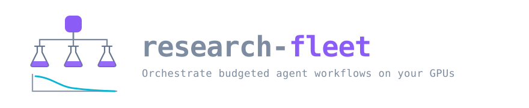

<p align="center">
  
</p>

<p align="center">
  
  
  
  
</p>

<p align="center">
  Define a research workflow once, then orchestrate it across your GPUs:<br>
  multi-step pipelines, priced before they run, under a budget they cannot exceed.
</p>

> [!WARNING]
> **Work in progress. Use at your own risk.** This is a personal research tool under
> active development. Interfaces will change without notice.
> It runs AI agents autonomously against your code and your GPUs, and it
> spends real money doing so. The budget ceilings and safeguards described below are
> best-effort, not guarantees: set a low `--max-usd`, keep your work under version
> control, and check your provider's billing dashboard yourself. Set
> `isolate_agents: true` so agents work on their own branch rather than your tree.

---

## What it is

A scheduler for scientific work on GPUs, from a hyperparameter sweep to an agent that
designs its own ablations. It runs two kinds of job:

- **`command`**: a training run, an eval, a sweep point. No LLM, no token cost.
- **`agent`**: a research agent with a repo, a GPU, and a question to answer.

Both get the same environment, the same resource limits, the same budget accounting,
and the same tamper-evident record of what happened. Because an agent is just another
job, **an agent can submit jobs of its own**, proposing configs, launching the runs,
reading the metrics, and iterating, bounded by the budget and policy of the parent that
spawned it.

There is one thing to set up and one place to look afterwards: declare the environment
once in `.ship.conf`, the limits once in `fleet.yaml`, then `fleet run`. Environments
come from **[research-ship](https://github.com/shs2017/research-ship)**, which is
useful on its own for interactive work.

## Install

Both tools install the same way: run them from a checkout, and the checkout becomes
disposable.

```bash
git clone https://github.com/shs2017/research-ship
cd research-ship && ./ship install && cd ..        # the GPU environment

git clone https://github.com/shs2017/research-fleet
cd research-fleet && ./fleet install               # the orchestrator
```

Both take an optional prefix (`./fleet install /usr/local`) and default to `~/.local`.
`fleet` lands in its own isolated environment, so it never collides with the
dependencies of whatever you are researching. To remove either:

```bash
fleet uninstall      # or ./fleet uninstall
ship uninstall
```

Uninstalling keeps your ledgers, results, Docker images and volumes, so removing and
reinstalling costs nothing.

Then set up the project you want to research in:

```bash
cd ~/my-project && ship init && ship build
```

Requires Docker with the NVIDIA container runtime, and `uv`:

```bash
docker run --rm --gpus all nvidia/cuda:12.4.1-base-ubuntu22.04 nvidia-smi -L
```

Working from a checkout without installing, `./fleet <command>` runs straight from the
source, which is handy while developing.

## Quick start

```bash
fleet cost                       # what does this cost, before I run it?

# four agents attack the same question independently, capped at $20 for the lot
fleet run "Does RMSNorm beat LayerNorm at 20M params? Run the ablation." --agents 4 --max-usd 20

fleet run "..." --agents 4 --gpus 0.25          # pack four agents onto one card
fleet run "..." --agents 16 --executor slurm    # submit to a Slurm cluster
fleet run "..." --agents 16 --executor ray      # or a Ray cluster

# a plain sweep, no LLM, no token cost
fleet sweep python train.py --lr {lr} --depth {depth} -g lr=1e-3,3e-4 -g depth=6,12

# a multi-step pipeline, for example a coder and reviewer loop
fleet workflow examples/code-review-loop.yaml
```

Then inspect what happened:

```bash
fleet runs                # every run
fleet ls <run_id>         # jobs in a run, including agent-spawned children
fleet trace <job_id>      # full reasoning and tool trace for one agent
fleet pending             # jobs parked waiting for approval
fleet audit verify        # prove the log has not been edited
```

## Workflows

Most research is a pipeline, not one prompt. A workflow declares the stages, and a
`loop` repeats until a condition holds, which is how a coder and reviewer cycle works:

```yaml
# examples/code-review-loop.yaml
name: code-review-loop
model: claude-sonnet-5      # default for every step
isolate: true               # each agent works on its own git branch

stages:
  - name: plan
    task: Write an implementation plan for adding a --seed flag, into PLAN.md.

  - name: implement-and-review
    loop:
      max_iterations: 3
      until:
        step: review
        output_contains: APPROVED
      steps:
        - name: implement
          task: |
            Follow PLAN.md and implement the change.
            {{ steps.review.output }}
            If the text above contains feedback, address it.
        - name: review
          model: claude-opus-5        # review with the stronger model
          task: |
            Review the tree against PLAN.md. Reply with exactly APPROVED
            on its own line if it is ready, otherwise list what must change.

  - name: verify
    kind: command
    command: ["python", "-m", "pytest", "-q"]
```

```bash
fleet workflow examples/code-review-loop.yaml --plan     # validate and show the stages
fleet workflow examples/code-review-loop.yaml --max-usd 10
```

`{{ steps.<name>.output }}` carries a step's answer into a later prompt, which is what
lets the reviewer's objection reach the next implementation round. `{{ iteration }}` and
`{{ item }}` are also available. Templating is plain substitution rather than an
expression language, and loop conditions are declarative
(`output_contains`, `output_not_contains`, `succeeded`), so reading the YAML tells you
when the loop stops.

### Writing it as a dependency graph

`graph:` is a mapping of node to node, where the edges are the point and there is no
implicit ordering. **Cycles are allowed, and a cycle is how you say "repeat":**

```yaml
name: implement-and-review
max_iterations: 4            # default cap on how many times a cycle repeats

graph:
  plan:
    task: Write PLAN.md.

  implement:
    task: "Follow PLAN.md. {{ steps.review.output }} Address any feedback above."
    needs: [plan, review]    # depends on the reviewer, which closes the cycle

  review:
    task: Review the tree. Reply APPROVED if ready, else list what must change.
    needs: [implement]
    until:
      output_contains: APPROVED    # ends the cycle it belongs to

  verify:
    kind: command
    command: [pytest, -q]
    needs: [review]

  document:
    task: Update the README.
    needs: [review]
```

`implement` and `review` depend on each other, so they form a cycle and repeat as a
unit. `plan` runs before it, and `verify` and `document` run after it, in parallel.
`--plan` shows exactly that:

```console
$ fleet workflow implement-and-review.yaml --plan
warning: cycle implement -> review -> implement repeats, at most 4 time(s).
Stops early when review is satisfied.
  wave 1
    plan (agent)
  wave 2 cycle implement -> review -> implement  (until review says so, max 4x)
    implement (agent)
    review (agent)
  wave 3 (in parallel)
    document (agent)  after review
    verify (command)  after review
```

A node may also depend on **itself**, which is the shortest way to repeat one step:

```yaml
graph:
  tune:
    task: Adjust the config and report validation loss as a bare number.
    needs: [tune]
    max_iterations: 6
```

**Cycles always terminate.** Every cycle is bounded by `max_iterations`, from the node
if it sets one, otherwise the workflow default. `until` on any node in the cycle ends it
early. A cycle with no `until` runs every round, and `fleet` warns you about that up
front so an indefinite-looking loop is never a surprise:

```
warning: cycle a -> b -> a repeats, at most 3 time(s). No stop condition, so it
will always run all 3 rounds. Add `until` to a node in the cycle to end it sooner.
```

### Or as an ordered list

`stages:` is the same model with sequencing built in, which suits a straight pipeline:

- a stage **with** `needs` runs once those finish, so siblings sharing a dependency run
  in parallel;
- a stage **without** `needs` runs after everything declared before it, which keeps a
  plain list sequential and makes a bare stage a natural barrier.

The two spellings mix in one file. `stages:` entries come first, `graph:` nodes after,
and `needs` may point in either direction:

```yaml
stages:
  - name: setup
    task: Prepare the data.
graph:
  left:  {task: "Try approach A.", needs: [setup]}
  right: {task: "Try approach B.", needs: [setup]}
```

Execution is wave by wave: everything in a wave starts together and the next wave waits
for all of it. A cyclic component takes a wave to itself, since its nodes repeat
together.

### Running work in parallel### Running work in parallel

`copies` runs the same step several times; `for_each` runs it once per item:

```yaml
  - name: explore
    task: Propose and test one way to cut memory use. Report the result.
    copies: 4                    # four independent attempts, one per GPU slot

  - name: ablate
    task: Train with norm={{ item }} and report validation loss.
    for_each: [rmsnorm, layernorm, none]
```

### The same thing in Python

Identical model, so a workflow can be built or generated in code, and stopping
conditions that YAML cannot express become a callable:

```python
from research_fleet import Condition, Fleet, Loop, Step

tune = Loop(
    name="tune",
    max_iterations=5,
    steps=[Step(name="try", task="Adjust the config and report val loss as a bare number.")],
)

with Fleet(max_usd=20) as fleet:
    report = fleet.run_workflow(
        {"name": "tune-lr", "stages": [tune.model_dump()]},
        predicates={"tune": lambda steps: float(steps["try"].output or 1) < 0.35},
    )
    print(report.summary())
```

### Three entry points, one implementation

```python
from research_fleet import Fleet

with Fleet(max_usd=20) as fleet:
    fleet.run_agents("Test 3 attention variants and report validation loss", n=4)
    print(fleet.wait().summary())
```

```bash
claude mcp add research-fleet -- fleet mcp    # drive it from Claude Code or Codex
```

## How it works

```
                          ┌───────────────┐
  CLI / Python / MCP ────▶│   Scheduler   │──▶ Policy ─▶ Budget ─▶ Ledger
                          └───────┬───────┘  (deny)   (reserve)  (append)
                                  │
                        ┌─────────▼─────────┐
                        │     Executor      │  ship │ slurm │ ray │ dry-run
                        └─────────┬─────────┘
                                  │  `ship docker-args` + the fleet's limits
                   ┌──────────────┴──────────────┐
                   ▼                             ▼
       research-ship env (GPU 0)     research-ship env (GPU 1)
            research agent                python train.py
                   │
                   └── writes a job spec to $FLEET_SUBMIT_DIR ──▶ Scheduler
```

| Module | Responsibility |
| --- | --- |
| `spec.py` | `JobSpec` / `JobResult`, the data model, with content fingerprints |
| `scheduler.py` | Dependency graph, fractional GPU slots, spool intake, state machine |
| `policy.py` | Every check that can say "no", as a pure function |
| `budget.py` | Price table, cost estimation, hierarchical reserve/commit tree |
| `ledger.py` | Hash-chained JSONL, SQLite index, secret redaction |
| `executors/` | `ship`, `slurm`, `ray`, `dry-run`, where a job is placed |
| `backends/` | `claude-cli`, `codex-cli`, how an agent is driven and parsed |
| `workflow.py` | Stages, loops, fan-out, templating, stop conditions |

### Division of labour

| Concern | Owner |
| --- | --- |
| Base image, CUDA, Python, torch, agent CLIs | research-ship, `.ship.conf` |
| `/workspace` mount, model cache, venv volume | research-ship |
| Non-root user, egress allowlist, credential scoping | research-ship |
| Which GPU, how much CPU/RAM, timeout | research-fleet, `fleet.yaml` |
| Recursion depth, fanout, budget, approval gates | research-fleet |
| Audit ledger, reasoning traces, cost accounting | research-fleet |

> [!NOTE]
> The fleet deliberately does **not** re-impose `--read-only`, `--user`, or
> `--cap-drop ALL`. Those would break research-ship's writable venv, its non-root
> user, and the `NET_ADMIN` its firewall needs. Isolation is research-ship's contract;
> the fleet adds only the limits that are a scheduling concern.

Credentials follow the same split. The fleet asks research-ship for them only on
`agent` jobs; a sweep point or a training run runs without any token at all.

## Where jobs run

| Executor | Placement | Container |
| --- | --- | --- |
| `ship` | This host; the fleet allocates GPUs by UUID and can pack fractions | research-ship, via Docker |
| `slurm` | Slurm picks the node and binds the GPUs | Apptainer, or none |
| `ray` | Ray places across the cluster | research-ship, via Docker |
| `dry-run` | Nothing runs | none |

On a cluster you usually cannot reach the Docker daemon, so the Slurm executor submits
with `srun` and runs jobs either directly in the allocation or inside an Apptainer image:

```yaml
executor:
  kind: slurm
  slurm:
    partition: gpu
    account: my-lab
    slots: 16                                 # srun processes held open; the rest queue
    container_image: /images/research.sif      # omit to use the cluster environment
```

`slots` is the only knob that needs thought: Slurm does the real queueing, so this just
caps how many submissions the fleet keeps in flight. Fractional GPUs round up, because
`--gres` cannot express half a device.

## What it cost

Every finished job is recorded, so spend and compute are queryable across runs rather
than scrolling back through logs:

```console
$ fleet usage --by run,stage
                          usage by run,stage
┌──────────────────┬───────────┬──────┬─────────┬─────────┬─────────┬───────┬───────┐
│ run              │ stage     │ jobs │  tokens │    cost │ agent_s │wall_s │ gpu_s │
├──────────────────┼───────────┼──────┼─────────┼─────────┼─────────┼───────┼───────┤
│ run_fd139aed1e59 │ review    │    3 │ 902,431 │ $0.4812 │      61 │    77 │    77 │
│ run_fd139aed1e59 │ implement │    3 │ 210,004 │ $0.1104 │      28 │    34 │    34 │
└──────────────────┴───────────┴──────┴─────────┴─────────┴─────────┴───────┴───────┘
6 job(s)  $0.5916  1,112,435 tokens  89s agent / 111s wall  111 GPU-seconds  14 request(s)
```

Group by `run`, `model`, `stage`, `attempt`, `workflow`, `name`, `kind`, `backend`,
`state`, `day` or `job`, and combine them with commas. `--jobs` lists every job instead
of totals; `--run`, `--days` and `--kind` narrow it.

**A repeated node counts once per attempt.** A cycle that runs three times gives three
rows under `--by stage,attempt`, so you can see whether a review loop is getting cheaper
or more expensive as it iterates, rather than one merged figure.

**Agent time and wall time are separate.** `agent_s` is what the harness reported working;
`wall_s` includes starting the container and pulling the image. `gpu_s` is GPUs multiplied
by wall time, which is what a shared cluster actually charges you for.

The same data in Python:

```python
with Fleet() as fleet:
    print(fleet.usage())                       # totals across every run
    print(fleet.usage("model"))                # per model
    print(fleet.usage("run,stage,attempt"))    # per attempt of each stage
    print(fleet.usage_jobs(run_id="run_abc"))  # one row per job
```

This table is derived from the ledger, not a second source of truth, so
`fleet audit reindex` rebuilds it from the JSONL if it is ever lost or stale.

## Auditability

Every state change is appended to `<root>/ledger.jsonl` **before it takes effect**.
Each record carries `prev_hash` and `hash`, chaining back to genesis.

```console
$ fleet audit verify
✓ audit chain intact, 1,284 events verified
```

Editing a payload, deleting a record, or reordering the file all break the chain and
are reported with the sequence number where it broke. The JSONL is the source of truth;
the SQLite index is disposable (`fleet audit reindex`).

Agent output is parsed as it streams, so a job that crashes halfway still leaves a
complete record up to the failure:

```console
$ fleet trace job_a1b2c3d4
14:22:01 agent: The baseline diverges above lr=1e-3, so I'll bisect downward.
14:22:03 tool  Bash            {"command": "python train.py --lr 5e-4"}
14:22:47 result
14:22:47 budget $0.0412 (18,204 tokens)
```

Secrets are scrubbed on the **write** path, by key name and by value shape
(`sk-ant-...`, `ghp_...`, `AKIA...`, JWTs). An append-only log cannot be cleaned up
after the fact, so redaction has to happen before the value is ever persisted. Secrets
reach containers as bare `--env KEY` names, so they never appear in a recorded argv.

## Token and cost awareness

Costs are computed from reported `usage` against a price table, not guessed. Before a
job runs, `quote()` estimates it from the model, the reasoning `effort`, and the shape
of the work, since an agent loop re-reads its growing context every turn while a single
call does not.

```console
$ fleet cost
        Estimated cost per agent standard
┌──────────────────┬────────┬───────────┬─────────────┐
│ model            │ effort │ est. cost │ est. tokens │
├──────────────────┼────────┼───────────┼─────────────┤
│ claude-haiku-4-5 │ low    │ $0.309    │     515,000 │
│ claude-sonnet-5  │ high   │ $1.903    │     580,000 │
│ claude-opus-5    │ high   │ $3.172    │     580,000 │
└──────────────────┴────────┴───────────┴─────────────┘
```

**Budgets are hierarchical.** A run opens a root scope; each agent gets a child scope
carved from its parent's remaining balance; spend rolls up to every ancestor. A
sub-agent cannot spend money its parent does not have, so a runaway delegation tree is
bounded by construction. A scope is released only once every descendant is terminal.

Jobs also *reserve* their estimate at submit time and settle against real usage at
exit. Without that, twenty agents each individually fit the budget while collectively
blowing it.

## Agents that design their own experiments

An agent can propose configurations, launch the runs, read the metrics, and iterate.
To spend responsibly it needs to know what things cost, so its prompt carries a budget
briefing: remaining balance, the per-model prices from the table above, and how deep it
already is. The guidance it gets is to delegate broad or low-stakes work to a cheaper
model at lower effort, and reserve the expensive tier for reasoning that needs it.

To launch work, the agent writes a JSON spec into `$FLEET_SUBMIT_DIR`:

```bash
cat > "$FLEET_SUBMIT_DIR/sweep-lr.json" <<'EOF'
{ "kind": "command",
  "name": "sweep-lr",
  "command": ["python", "train.py", "--lr", "3e-4"],
  "resources": {"gpus": 1} }
EOF
```

**A spool directory, not a socket.** The scheduler picks the file up and runs it
through the same policy and budget path as any other job. This keeps
`network.mode: none` viable for agent containers, gives every child a durable
provenance record naming its parent, and means a compromised agent gets a queue slot
rather than a control channel. An agent cannot choose its own image, so it cannot
escape the environment the operator configured. Rejections come back as
`<name>.rejected.json` with a readable reason.

## Safeguards

Policy runs on the submit path and is a pure function of `(spec, context) -> Decision`,
so `fleet policy` shows exactly what is enforced.

| Layer | Default |
| --- | --- |
| Recursion | `max_agent_depth: 2`, `max_children_per_agent: 8` |
| Budget | `$50` per run, `$25` per job; hierarchical, reserved up front |
| Resources | Per-job GPU / memory / timeout ceilings; timeouts clamped, not denied |
| Filesystem | Mounts must resolve inside an allowlist; `/`, `/etc`, `~/.ssh`, `~/.aws`, the Docker socket are refused |
| Credentials | Withheld from `command` jobs entirely; scoped per project for `agent` jobs |
| Working tree | `isolate_agents: true` gives every agent its own git worktree and branch |
| Container | Non-root user and cache isolation from research-ship; `--pids-limit` from the fleet |
| Network | `limited` by default, using research-ship's default-deny egress allowlist |
| Commands | Denylist for destructive patterns (`rm -rf /`, nested `docker run`, fork bombs) |
| Approval | Unrestricted network or a writable mount outside the workspace parks the job |

`fail_closed: true` means a check that cannot be evaluated denies rather than allows.
`wait()` returns rather than hanging when the only remaining work needs a human, and
`fleet pending` shows what is blocked and why.

Approval is **in-process**: a parked job belongs to a live scheduler, so grant it with
`fleet.approve(job_id)` from the session that submitted it (or via MCP). There is no
cross-process `fleet approve`, because a job whose scheduler has exited cannot be
resumed, only resubmitted.

> [!WARNING]
> **Known limits.** The egress allowlist resolves domains to IPs at container start, so
> CDN rotation can break a long run, and it restricts where traffic goes rather than
> what it carries. The price table is a snapshot (`budget.PRICES_AS_OF`), overridable
> via `budget.model_costs`, so verify spend against your provider's billing rather than
> trusting these numbers. `/workspace` is a read-write bind mount to your real project
> directory unless you set `WORKTREE_DEFAULT=1` in `.ship.conf`, which is strongly
> recommended for unattended runs.

## Configuration

Precedence, lowest to highest:

```
defaults < ~/.config/research-fleet/config.yaml < ./fleet.yaml < FLEET_* env < CLI flags
```

Env vars use `__` for nesting, for example `FLEET_EXECUTOR__KIND=ray`. See
[`fleet.yaml`](fleet.yaml) for the fully commented surface.

Container configuration is **not** here. It lives in the project's `.ship.conf` and
belongs to research-ship.

## Development

```bash
git clone https://github.com/shs2017/research-fleet && cd research-fleet
uv venv && uv pip install -e ".[dev]"
pytest -q
```

105 tests, 95% line coverage:

```bash
coverage run -m pytest && coverage report
```

Nothing needs a GPU or Docker. The `dry-run` executor exercises the scheduler, policy
and ledger without starting containers, and the executor tests drive `ShipExecutor`
against a fake `ship` and a fake `docker` on disk, which is how streaming, timeouts and
cancellation get covered.
